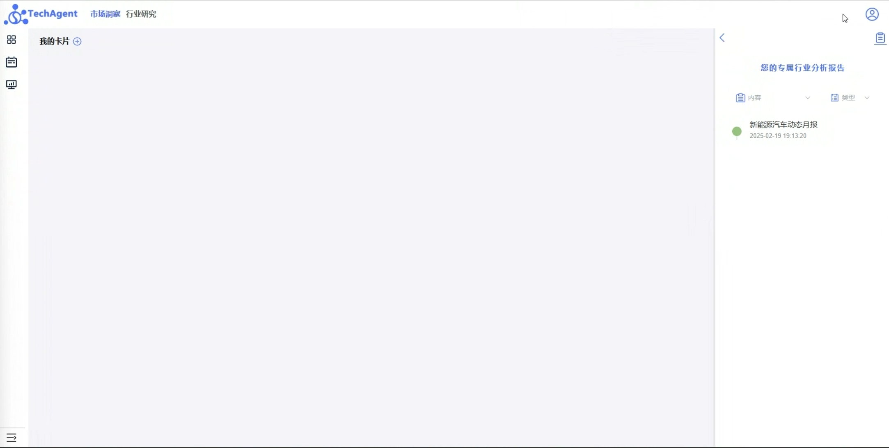

# 踩坑笔记：首次登录修改密码导致前端空白页面  

## **问题描述**  

客户通过邮件链接进行邮箱验证登录（emailVerifyLogin）后，界面为空白，无法正常显示内容，同时退出登录或路由跳转也存在异常。  



## **排查过程**  

### 1. **初步怀疑前端路由问题**  

- 但自己访问后未能复现，排除路由导致的问题。  

### 2. **可能的数据问题**  

- 参考用户的 `userInfo` 数据，新建了一个一模一样的账户测试，仍然无法复现问题，说明数据本身没有问题。  

### 3. **深入检查前端代码**  

- 发现前端有一段逻辑：**当用户首次登录时，强制修改密码**。  
- 该逻辑只在 `login` 代码中处理，而 `emailVerifyLogin` 逻辑中 **未判断 402 状态码**。  
- 402 业务逻辑：当 `is_first_login` 为 `true` 时，返回 402 让用户修改密码，否则后端接口会持续报业务错误。  

### 4. **复现客户问题**  

- 让后端修改 `is_first_login` 字段，使其返回 402，结果发现所有接口都报 402，完美复现客户问题。  
- 发现是 **注册流程调整导致后端新老逻辑不一致**，用户无法重置密码，同时前后端对 402 业务错误做了特殊处理，不会直接报错，导致白屏问题。  

## **最终解决方案**  

- **前端**：在 `emailVerifyLogin` 逻辑中增加 402 处理，确保用户首次登录都能正确进入修改密码流程。  
- **后端**：调整 `is_first_login` 相关逻辑，确保新注册流程不会导致用户无法重置密码。  

## **关键代码修复**  

```vue
// 用户首次登录，强制修改密码
if (res.code == 402) {
  proxy.$message.info(res.msg);
  resetPasswordilVisible.value = true;
  return;
}
```

## **经验总结**  

1. **前后端业务逻辑需要保持一致，避免新老流程冲突。**  
2. **对于特殊状态码（如 402），所有登录方式都要进行相应的处理，不能遗漏。**  
3. **遇到难以复现的问题时，可模拟相同的 `userInfo` 数据，并调整后端状态尝试复现。**  
4. **前端逻辑改动后，要确保所有入口（login / emailVerifyLogin）都能正确执行相关逻辑。**  
