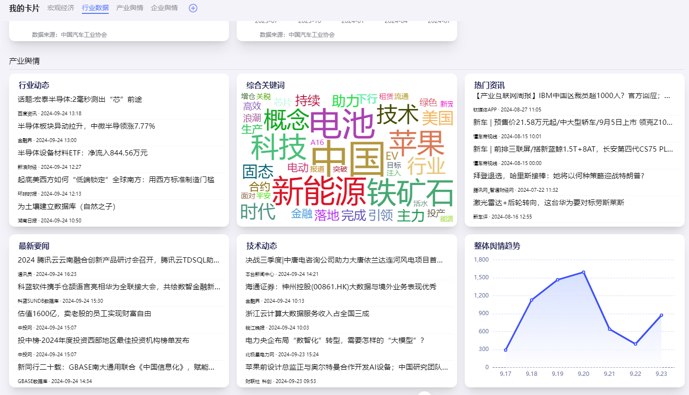

# 列表组件懒加载子元素

## 问题

列表组件中，子元素获取数据时机在onMounted生命周期,每个子元素单独发起请求，当列表组件中的子元素过多时，会导致页面加载缓慢且发起过多请求占用较高带宽，如何解决？



(后端吐槽这块跟ddos一样😅)


## 解决方案

### 组件懒加载

1. 思路

    通过`IntersectionObserver`监听元素是否进入视口，进入视口时再渲染组件,发起请求获取数据
  
2. 实现

    ```vue
    //lazyLoad.vue
    <script lang="ts" setup>

    import { useIntersectionObserver } from "@vueuse/core";

    const props = defineProps<{
    loadClass: string;
    }>();

    const targetRef = ref();
    const targetIsVisible = ref(false);

    //这里使用vueuse的useIntersectionObserver
    const { stop } = useIntersectionObserver(targetRef, ([{ isIntersecting }], observerElement) => {
    targetIsVisible.value = isIntersecting;
    if (targetIsVisible.value) {
        //停止监听,防止重复触发
        stop();
    }
    });
    </script>
    <template>
    <div class="wh-full" ref="targetRef">
        <transition
            enterActiveClass="transition duration-300 ease-in-out"
            enterFromClass="opacity-0"
            enterToClass="opacity-100 "
            leaveActiveClass="transition duration-300 ease-in-out"
            leaveFromClass="opacity-100 "
            leaveToClass="opacity-0 "
        >
            <template v-if="targetIsVisible">
                <slot></slot>
            </template>
            <template v-else>
                <!-- 未进入视口时先展示骨架屏 -->
                <slot name="skeleton">
                    <div :class="[props.loadClass]">
                        <el-skeleton class="wh-full flex flex-col p-2 gap-4" animated>
                            <template #template>
                                <el-skeleton-item variant="image" class="w-full h-0 flex-1 rounded-md" />
                            </template>
                        </el-skeleton>
                    </div>
                </slot>
            </template>
        </transition>
    </div>
    </template>

    <style lang="scss" scoped></style>

    ```

    ```vue
    //cardList.vue
    <template>
        <div>
            <template v-for="item in list">
                <lazy-load>
                    <template #skeleton>
                        <div class="flex flex-col justify-start p-2 select-none wh-full bg-#ffffff rounded-3 shadow-xl">
                        <el-skeleton class="wh-full flex flex-col p-2 gap-4" animated>
                            <template #template>
                            <div class="flex justify-between">
                                <el-skeleton-item variant="text" style="margin-right: 16px" />
                                <el-skeleton-item variant="text" style="width: 30%" />
                            </div>
                            <el-skeleton-item variant="image" class="w-full h-0 flex-1 rounded-md" />
                            </template>
                        </el-skeleton>
                        </div>
                    </template>
                <card-item name="card" :code="item.code" :card="element.card"> </card-item>
                </lazy-load>
            </template>
        </div>
    </template>
    ```

3. 难点
    1. `IntersectionObserver`监听对象
        正常情况下,`IntersectionObserver`肯定是监听list里面的item,通过ref传入lazyLoad组件,但如果通过list传入,那么每个item都需要一个ref,这样会导致ref过多,不利于维护。

        因此，比较好的方案是用一个div重新包裹一层，通过这个div监听是否进入视口，当这个div进入视口时，再去渲染子组件。

        但这个div有可能影响内部组件的样式，所以需要在这个div上设置一些样式，使其不影响内部组件的样式。

        通过loadClass传入原来父盒子样式，配置给这个div，使其不影响内部组件的样式。

        同时，骨架屏也可以保持和真实内容一致，这样在切换时不会出现抖动。
