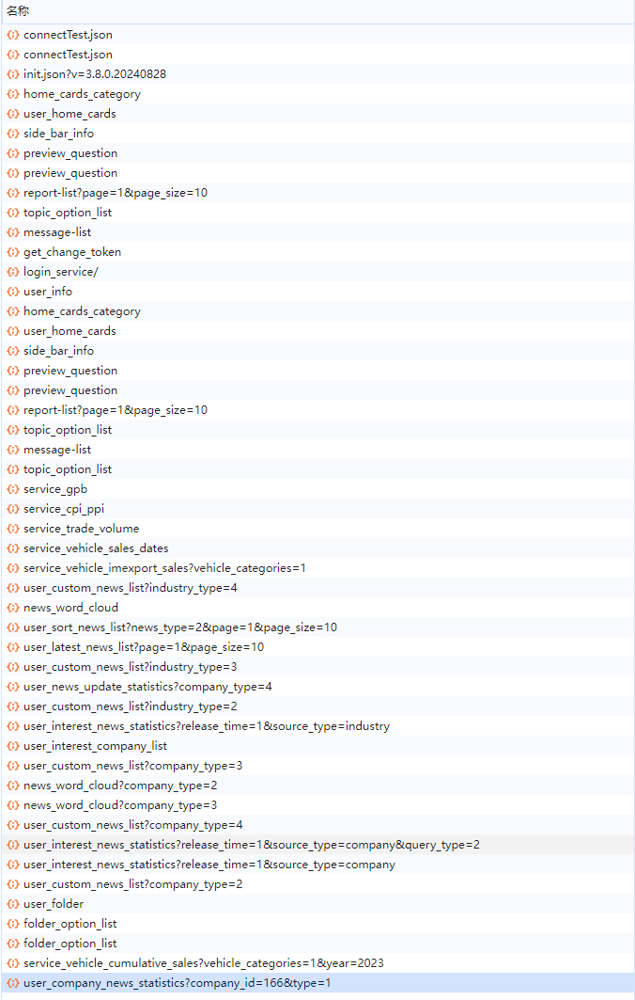

# 列表组件懒加载子元素

## 问题描述

在列表组件中，如果每个子元素的数据获取都在组件的 `onMounted` 生命周期钩子中单独发起请求，当列表中的子元素数量较多时，会导致以下问题：

- 页面加载速度变慢。
- 发起过多的网络请求，占用较高的带宽资源。
- 后端服务器可能因短时间内接收到大量请求而感到压力。


*后端反馈：这看起来就像DDoS攻击 😅*



## 解决方案

### 组件懒加载

#### 设计思路

采用 `IntersectionObserver` API 监听列表项是否进入可视区域（viewport）。只有当列表项进入用户视线范围内时，才开始渲染对应的组件并发起数据请求。这样可以显著减少初始加载时的请求数量，提高用户体验。

#### 技术实现

通过封装一个懒加载组件 `LazyLoad.vue`，将 `IntersectionObserver` 的功能集成进去。此组件接受一个 `loadClass` 属性，用于传递给内部的占位元素，确保其外观与实际内容保持一致，从而避免因内容加载而导致的页面布局变动。

```vue
<!-- LazyLoad.vue -->
<template>
  <div :class="['wh-full', loadClass]" ref="targetRef">
    <transition
      enter-active-class="transition duration-300 ease-in-out"
      enter-from-class="opacity-0"
      enter-to-class="opacity-100"
      leave-active-class="transition duration-300 ease-in-out"
      leave-from-class="opacity-100"
      leave-to-class="opacity-0"
    >
      <slot v-if="targetIsVisible"></slot>
      <slot v-else name="skeleton">
        <el-skeleton class="wh-full flex flex-col p-2 gap-4" animated>
          <template #template>
            <el-skeleton-item variant="image" class="w-full h-0 flex-1 rounded-md" />
          </template>
        </el-skeleton>
      </slot>
    </transition>
  </div>
</template>

<script lang="ts" setup>
import { ref } from 'vue';
import { useIntersectionObserver } from '@vueuse/core';

const props = defineProps<{
  loadClass: string;
}>();

const targetRef = ref(null);
const targetIsVisible = ref(false);

const { stop } = useIntersectionObserver(
  targetRef,
  ([{ isIntersecting }]) => {
    if (isIntersecting) {
      targetIsVisible.value = true;
      stop(); // 停止观察，防止多次触发
    }
  },
  { threshold: 0.1 } // 可选配置：当目标元素10%可见时即认为已进入视口
);
</script>

<style lang="scss" scoped>
/* 根据需要添加样式 */
</style>
```

接下来，在列表组件中使用 `LazyLoad.vue` 包裹每个子项，同时提供骨架屏作为加载状态下的占位符。

```vue
<!-- CardList.vue -->
<template>
  <div>
    <template v-for="item in list" :key="item.id">
      <LazyLoad :loadClass="item.class">
        <template #skeleton>
          <div class="flex flex-col justify-start p-2 select-none wh-full bg-white rounded-lg shadow-md">
            <el-skeleton class="wh-full flex flex-col p-2 gap-4" animated>
              <template #template>
                <div class="flex justify-between">
                  <el-skeleton-item variant="text" style="margin-right: 16px;" />
                  <el-skeleton-item variant="text" style="width: 30%;" />
                </div>
                <el-skeleton-item variant="image" class="w-full h-0 flex-1 rounded-md" />
              </template>
            </el-skeleton>
          </div>
        </template>
        <CardItem :name="item.name" :code="item.code" :card="item.card" />
      </LazyLoad>
    </template>
  </div>
</template>

<script lang="ts" setup>
// 导入所需依赖
</script>

<style lang="scss" scoped>
/* 样式代码 */
</style>
```

#### 优化亮点

- **性能优化**：通过懒加载机制减少了不必要的网络请求，减轻了前后端的压力。
- **用户体验**：使用骨架屏作为加载指示器，提升了视觉上的流畅度和一致性。
- **代码复用**：`LazyLoad.vue` 可以轻松应用于其他需要懒加载功能的场景，增强了代码的可维护性和扩展性。
